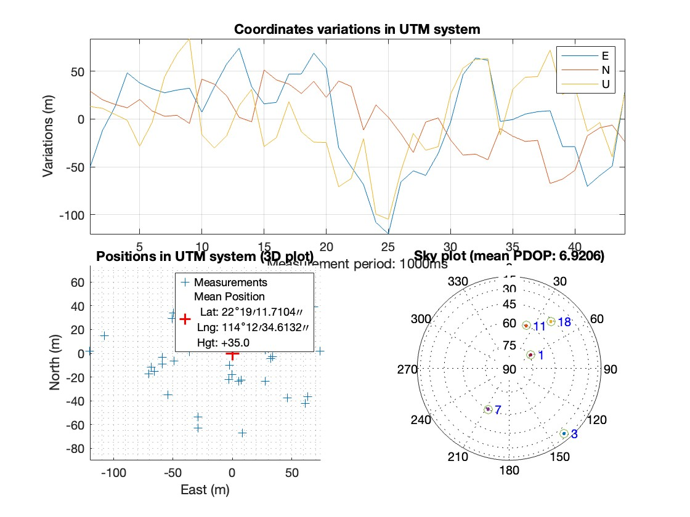
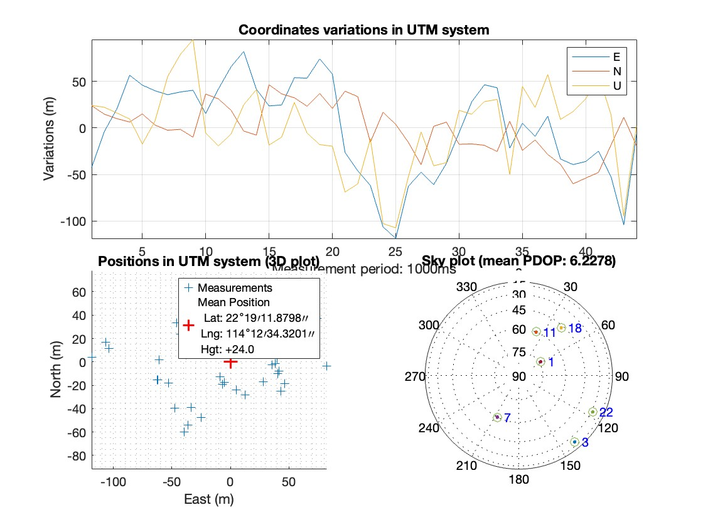

# Assignment 2


# Task 1-Differential GNSS Positioning

```  
Model: ChatGPT-4o 
Prompt: (1) please compares the pros and cons of Differential GNSS, Real-Time Kinematic (RTK),Precise Point Positioning (PPP) and PPP-RTK techniques for smartphone navigation.
```  
When considering high-accuracy positioning for smartphone navigation, four GNSS correction techniques stand out: Differential GNSS (DGNSS), Real-Time Kinematic (RTK), Precise Point Positioning (PPP), and PPP-RTK. Each method offers different levels of accuracy, infrastructure requirements, convergence time, and suitability for smartphones. Understanding their individual strengths and weaknesses is important when selecting the most appropriate approach for smartphone-based applications.

**Differential GNSS (DGNSS)**

**Pros**

 DGNSS improves basic GNSS positioning by using correction data from a known reference station to reduce common errors such as satellite clock drift, atmospheric delay, and orbital inaccuracies. The main advantage of DGNSS is its simplicity and ease of implementation. It requires minimal additional hardware and is compatible with most GNSS-capable smartphones. With correction data provided by public or commercial sources, DGNSS can improve positioning accuracy from around 5–10 meters down to approximately 1–3 meters. It works in real time and converges quickly, making it suitable for general navigation tasks like driving or pedestrian guidance.

**Cons**

However, the downside of DGNSS is its limited precision. It does not use carrier-phase measurements, which are required for centimeter-level positioning. DGNSS is also sensitive to the distance between the user and the reference station—the farther the user is from the station, the less accurate the corrections become. Furthermore, it offers limited benefit in dense urban areas, where multipath effects and signal obstructions are common and not corrected by DGNSS. For applications such as augmented reality or precise mapping, its accuracy may be insufficient.

**Real-Time Kinematic (RTK)**

**Pros**

 RTK offers significantly higher accuracy, often down to the centimeter level, by using both pseudorange and carrier-phase measurements along with real-time corrections from a nearby base station. RTK’s greatest advantage is its precision. It is widely used in surveying, robotics, and autonomous vehicles, where highly accurate real-time positioning is essential. RTK also offers fast convergence, often within seconds, making it suitable for dynamic applications requiring immediate precision.

**Cons**

Despite these benefits, RTK presents several challenges for smartphone navigation. It requires a reliable and low-latency connection to a base station or a virtual reference network, which may not be consistently available in all regions. RTK also relies on dual-frequency GNSS data and robust carrier-phase tracking—capabilities that are still limited or poorly supported on many consumer smartphones. The low-quality antennas and noisy environments typical of smartphone use degrade the carrier-phase signal quality, often making RTK difficult or impossible to use without external hardware such as a dedicated GNSS receiver or antenna.

**Precise Point Positioning (PPP)**

**Pros**

 offers a global solution by using precise satellite orbit and clock corrections, allowing for improved positioning accuracy without needing a local reference station. The main advantage of PPP is that it works anywhere in the world and requires only a GNSS receiver with access to real-time correction data. This makes PPP an attractive option for smartphone users in remote or infrastructure-poor areas. With dual-frequency support, PPP can achieve decimeter-level accuracy, and it is more tolerant of signal degradation compared to RTK.

**Cons**

However, PPP comes with the significant drawback of long convergence times. Achieving its highest level of accuracy can take 10 to 30 minutes, which is impractical for many real-time or short-term smartphone applications. The performance of PPP also depends on the quality of the GNSS measurements, and smartphones often lack the hardware necessary to maintain clean, consistent signals. Additionally, PPP requires access to correction services, which may not be free or universally available.

**PPP-RTK**

**Pros**

 PPP-RTK is a hybrid technique that combines the global corrections of PPP with regional atmospheric and satellite corrections to enable fast ambiguity resolution. The key advantage of PPP-RTK is that it offers the accuracy of RTK and the global applicability of PPP, with much faster convergence—often within one to two minutes. It does not rely on a nearby base station and can deliver high precision even in areas without dense infrastructure. As some modern smartphones begin supporting dual-frequency GNSS, PPP-RTK becomes a promising solution for delivering real-time, high-accuracy positioning.

**Cons**

On the downside, PPP-RTK still requires reliable access to real-time correction data, typically over the internet, which may not be consistently available. The system is also more complex, requiring regional models for ionospheric and tropospheric delays, which are often maintained by commercial services. For smartphones, the effectiveness of PPP-RTK depends heavily on the quality of GNSS signals, which are still limited by low-grade antennas and frequent signal obstructions in urban environments.

**Conclusion**

In conclusion, each technique offers trade-offs. DGNSS is simple and fast but lacks precision. RTK is highly accurate but hardware-intensive. PPP provides flexibility but suffers from slow convergence. PPP-RTK blends accuracy and speed but demands reliable corrections and high-quality signals. As smartphones evolve with better GNSS chips and dual-frequency support, PPP-RTK is likely to become the most viable option for high-precision smartphone navigation.


# Task 2- GNSS in Urban Areas

We use skymask to weight the satelites.

Weighting Scheme:

•	LOS satellites: weight = (sin(elevation))²

•	Blocked satellites: weight = 0.005 * (sin(elevation))²
 
Positioning results with and without skymask weighting are show below:

Without Skymask Weighting:



With Skymask Weighting:



As can be seen, height is improved from 35.0 to 24.0.

# Task 4- LEO Satellites for Navigation
```  
Model: ChatGPT-4o 
Prompt: (1) Please tell me the difficulties of using LEO communication satellites for GNSS navigation.
(2) Please explain the difference between LEO and tradictional techinch.
(3) From this difference, please explain the difficulties (high orbital velocity, increased complexity in satellite orbit determination and prediction, signal structure and timing, etc)
Comment: Both ChatGPT-4o and DeepSeek-R1 are free and powerful tools to answer these questions, it is great to refer to answers from them.
```  
Using Low Earth Orbit (LEO) communication satellites for GNSS navigation introduces several technical and practical challenges that distinguish them from traditional Medium Earth Orbit (MEO) GNSS systems such as GPS, GLONASS, or Galileo. While LEO satellites offer potential benefits like lower latency and stronger signal strength, their use in navigation applications presents unique difficulties that must be addressed.

One major challenge of using LEO satellites for navigation is their high orbital velocity and rapid movement across the sky. Unlike traditional GNSS satellites in MEO that maintain relatively stable positions for long periods, LEO satellites orbit the Earth in approximately 90 to 120 minutes. This means that a receiver on the ground observes each satellite for only a few minutes at a time, requiring constant satellite handovers and rapid acquisition of new signals. This dynamic nature complicates both signal tracking and the maintenance of continuous, accurate positioning.

Another difficulty is the increased complexity in satellite orbit determination and prediction. For traditional GNSS systems, the satellite orbits are well characterized and stable, allowing for precise long-term predictions. In contrast, LEO satellites experience greater atmospheric drag and require more frequent orbital updates due to their lower altitudes. Accurately predicting and disseminating the precise ephemeris data needed for positioning becomes more difficult, potentially reducing the reliability of position solutions if this data is not timely or accurate.

LEO satellite systems also face challenges in ensuring global coverage with adequate geometry for positioning. Because each satellite covers a smaller portion of the Earth at any given time due to its lower altitude, a much larger constellation is needed to provide consistent and redundant coverage necessary for robust navigation. Deploying and maintaining such a dense constellation requires significant cost, coordination, and technological infrastructure, particularly for ensuring uninterrupted service during satellite outages or maintenance.

Another issue is related to the signal structure and timing of LEO communications satellites, which are not originally designed for navigation. Unlike traditional GNSS signals, which are specifically structured to allow precise timing and ranging, LEO communication signals may not provide the necessary modulation characteristics, signal stability, or access to highly synchronized clocks. Adapting or augmenting these signals for accurate pseudorange and carrier-phase measurements requires significant changes to satellite payloads and ground segment coordination.

Furthermore, the Doppler shift experienced from LEO satellites is substantially higher than from MEO GNSS satellites due to their rapid motion. This causes a much larger frequency change in the received signal, complicating signal acquisition and tracking, particularly for low-cost or power-constrained receivers like those found in smartphones. GNSS receivers must be redesigned or enhanced with advanced algorithms to handle these rapidly varying Doppler effects without losing signal lock.

Lastly, integrating LEO satellite navigation with existing GNSS systems poses interoperability challenges. Hybrid positioning solutions that combine MEO and LEO signals must reconcile differences in signal timing, coordinate systems, and data formats. Achieving seamless fusion of LEO-derived measurements with legacy GNSS requires sophisticated receiver firmware and standardization efforts, which are still evolving. Without harmonized signal structures or common correction models, navigation performance may degrade when switching between systems or combining measurements.

In summary, while LEO satellites offer advantages like stronger signal power and faster update rates, their use in GNSS navigation presents significant hurdles. High satellite dynamics, increased ephemeris management, dense constellation needs, unsuitable signal formats, high Doppler shifts, and interoperability challenges all contribute to the technical complexity of using LEO systems for reliable and accurate global navigation.


# Task 5- GNSS Remote Sensing

```  
Model: ChatGPT-4o & DeepSeek-R1 
Prompt: (1) Please tell me how GNSS remote sensing impacted GNSS.
(2) Please take GNSS-R for a specific discussion.
```  

Global Navigation Satellite Systems (GNSS), commonly known for their crucial role in positioning, navigation, and timing (PNT), have also emerged as powerful tools in the field of remote sensing. Beyond helping us determine where we are on Earth, GNSS now enables scientists to observe and monitor various environmental and geophysical phenomena. Among the growing techniques in GNSS-based remote sensing, GNSS Reflectometry (GNSS-R) is particularly noteworthy for its innovative use of reflected satellite signals to infer information about Earth's surface conditions.

GNSS remote sensing applications begin with atmospheric monitoring. As GNSS signals travel from satellites to receivers, they pass through the Earth's atmosphere, where they experience slight delays and bending due to changes in atmospheric density. This effect is exploited in GNSS radio occultation (GNSS-RO), a technique used to derive vertical profiles of temperature, pressure, and humidity. By analyzing how GNSS signals are refracted during their passage through the atmosphere, GNSS-RO provides high-resolution data critical for weather forecasting, climate modeling, and tracking atmospheric disturbances.

In addition to atmospheric sensing, GNSS is also used to study the ionosphere. As signals travel through this charged layer of the atmosphere, they are influenced by the total electron content (TEC). Monitoring variations in TEC enables researchers to study space weather, ionospheric storms, and their effects on communication and navigation systems. GNSS data is particularly useful for detecting ionospheric disturbances caused by solar flares, geomagnetic storms, or even terrestrial events like volcanic eruptions and earthquakes.

A particularly innovative use of GNSS in remote sensing is GNSS Reflectometry (GNSS-R). This technique makes use of GNSS signals that are reflected off the Earth’s surface—such as oceans, ice sheets, soil, or even urban landscapes—and captured by specialized receivers. GNSS-R operates as a form of passive radar, where the GNSS satellite serves as the transmitter, and a receiver (often on a satellite or aircraft) collects both the direct and reflected signals. By comparing the time delay, Doppler shift, and amplitude of the reflected signal relative to the direct one, researchers can derive meaningful information about the reflecting surface.

One major application of GNSS-R is in oceanography. It can estimate sea surface height, roughness, and wind speed over the oceans—valuable parameters for weather prediction and climate studies. GNSS-R has also shown promise in detecting and tracking hurricanes, thanks to its ability to measure wind speeds under cloudy and stormy conditions where optical sensors fail.

On land, GNSS-R can be used to assess soil moisture, snow depth, and surface freeze-thaw cycles. Soil moisture is vital for agricultural planning and hydrological modeling, and GNSS-R offers a cost-effective, global-scale solution. Similarly, snow and ice monitoring using GNSS-R supports climate research and water resource management in cryospheric regions.

In conclusion, GNSS has evolved into a valuable remote sensing system, providing insights into the Earth's atmosphere, ionosphere, oceans, and land surfaces. GNSS Reflectometry, in particular, has expanded the scope of GNSS applications by turning reflected signals into a rich source of environmental data. As GNSS constellations grow and technology advances, GNSS-R will likely play an increasingly important role in global Earth observation.

